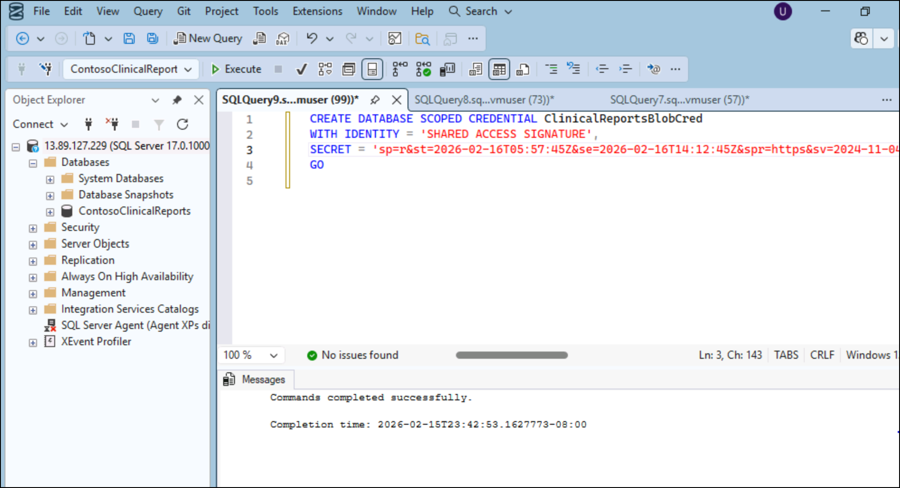
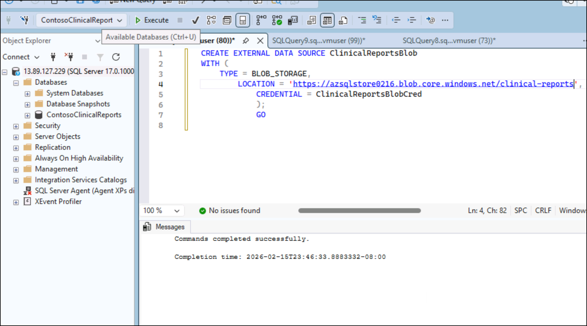
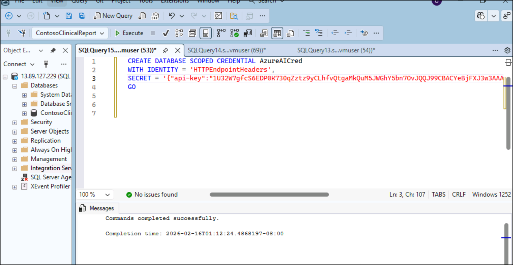
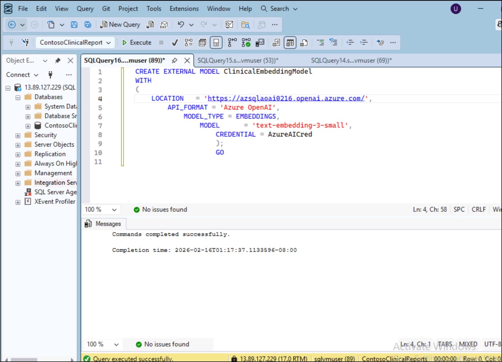
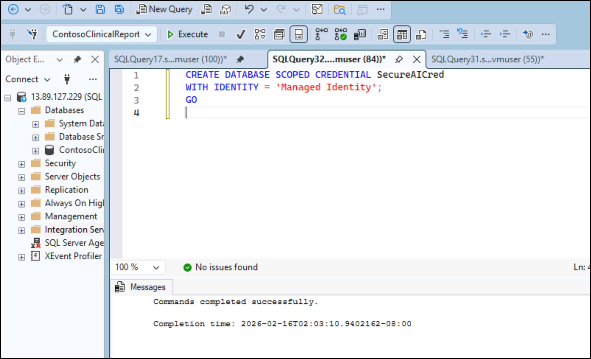

# **Lab 3: Building & Securing a Safe Clinical Report Search API** 

In this lab, participants step into a real-world healthcare scenario where a hospital needs a secure and intelligent way to search clinical discharge summaries using natural language. Using Microsoft SQL Server 2025, SQL Server Management Studio Copilot, Azure OpenAI Service, and Data API Builder, learners will build a secure semantic search API that enables staff to retrieve relevant clinical reports while ensuring patient data privacy through masking, RBAC, and managed identity. This hands-on experience demonstrates how modern AI capabilities can be integrated directly into SQL Server to create enterprise-ready, secure healthcare solutions.

**Objectives**

By the end of this lab, participants will be able to:

- Enable AI and vector search in Microsoft SQL Server 2025

- Generate embeddings using Azure OpenAI Service

- Implement semantic search with vector indexing

- Secure clinical data using masking, RBAC, and Managed Identity

- Expose search functionality as a REST API using Data API Builder

- Accelerate development with SQL Server Management Studio Copilot

## Exercise 1: Provision SQL Server on Azure VM

1.  Open browser enter  Azure SQL hub at +++https://aka.ms/azuresqlhub+++ or
    +++https://portal.azure.com+++ and sign in with your Azure subscription
    account. Enter **Azure SQL** in the search bar and select it.

    

2.  In the pane for **SQL Server on Azure Virtual Machines**,
    select **Show options**.

    

3.  In the **Select an image offer** box, choose a SQL Server image
    (such as **Free SQL Server License: SQL Server 2025 Enterprise
    Developer on Windows Server 2025**).Select **Create virtual
    machine**.

    

4.  On the **Basics** tab, provide the following information and then
    click **Next: Disk**

    - Subscription :- Select your subscription

    - In the **Resource group** - select an existing resource group from the
    list or choose **Create new** to create a new resource group.

    - Virtual machine name- +++azuresqlvm+++

    - **Region** - Central US

    - **Availability options** – *Availability zone*.

        1.  **Zone options** – Self-selected zone

        2.  **Availability zone** -Zone 1

    - In the **Image** list, select **Free SQL Server License: SQL Server
    2025 Enterprise Developer on Windows Server 2025** if it's not already
    selected.

    - Select **See all sizes** for the **Size** of the virtual machine and
    search for the **E4ds_v5** offering. This is one of the minimum
    recommended VM sizes for SQL Server on Azure VMs. be sure to clean up
    your resources once you're done with them to prevent any unexpected
    charges.

    Enter admin details as below:

    Username : +++sqlvmuser+++

    Password: +++AZvmsql12345+++

    - Under **Inbound port rules**, choose **Allow selected ports**, and
    then select **RDP (3389)** from the dropdown list.

    

    

    

    

    

    

5.  Keep default disk type values and click **Next: Networking**

    

6.  On Management page,

    
    
    

7.  Click on **SQL Server management** tab

    

8.  On SQL server setting spage,select below values and then click on
    **Review + create.**

    SQL connectivity : Public(internet)

    SQL authentication : Enable

    

9.  Once the validation is passed, click on **Create**.

    

10. Wait for the deployment to complete.

    

    

11. Copy the Public IP Address to connect from SSMS in next task

    

## Exercise 2: Create Azure OpenAI resource and deploy embedding models

1.  Switch back to Azure and search for +++*Azure OpenAI+++ and select it.

    

2.  Click on Create-\> Azure OpenAI.

    

3.  Enter below values and click **Next**:

    Subscription : your Azure subscription

    Resource Group – **Resourcegroup1**

    Region – **eastus**

    Name : +++azsqlaoaiXXXX+++ (replace XXXX with unique number)

    Pricing tier– Standard S0

    

4.  Keep the default value and click Next.

    

5.  Keep default tag and click Next.

    

6.  Review the details and click **Create**.

    

7.  Wait for the deployment successful and click on **Go to resource.**

    

8.  Expand Resource management-\> keys and endpoints form left
    navigation menu and copy endpoint and key value to a notepad to use
    in next tasks

    

9.  Click on **Overview** and select **Go to Foundry portal**

    

10. Click on **Deployments** under Shared resource from left navigation
    menu. Select **Deploy model-\> Deploy base model.**

    

11. Search for +++text-embedding+++ , select **text-embedding-3-small**
    model and click **Confirm**.

    

12. Keep the default values and click **Customize**

    

13. Set Tokens per Minute Rate limit to max and click **Deploy**.

    

    

## Exercise 3: Connect SQL server 2025 via SSMS 

1.  Double click on SSMS from task bar and select **Sign in with Microsoft**

    

2.  Select Work or School account and click Continue.

    

3.  Sign in with your assigned account.

    

    

    

12. Enter below details and click **Continue**.

    - Server name: **Azure VM public ip address,1433 (eg :8.234.343.54,1433)**

    - Authentication: **SQL Server Authentication**

    - Select **Trust Server certificate** checkbox

    

## Exercise 4: Enable SQL Server 2025 AI Capabilities

1.  In SSMS → New Query → run the below query

    ```
    CREATE DATABASE ContosoClinicalReports;
    GO
    USE ContosoClinicalReports;
    GO
    ```

2.  Run below query to enable outbound REST

    ```
    USE master;
    GO
    sp_configure 'external rest endpoint enabled', 1;
    GO
    RECONFIGURE WITH OVERRIDE;
    GO
    ```

    

3.  Run below query to **enable preview features in database.** This
    enables VECTOR type ,VECTOR INDEX , AI_GENERATE_EMBEDDINGS and
    VECTOR_SEARCH

    ```
    USE ContosoClinicalReports;
    GO
    ALTER DATABASE SCOPED CONFIGURATION  
    SET PREVIEW_FEATURES = ON;
    GO
    ```

    

4.  Run below query to create ClinicalReports table

    ```
    CREATE TABLE dbo.ClinicalReports
    (
        ReportID      INT           NOT NULL PRIMARY KEY,
        AgeGroup      NVARCHAR(50)  NULL,
        Department    NVARCHAR(100) NULL,
        ReportDate    DATE          NULL,
        ReportText    NVARCHAR(MAX) NULL,   -- discharge summary / note text
        PatientMRN    NVARCHAR(20)  NULL,   -- will be masked later
        Diagnosis     NVARCHAR(500) NULL
    );
    GO
    ```

    

5.  Run below query to **Create Master Key.** **Replace** YourStrongPassword123! With your password.

    ```
    USE ContosoClinicalReports;
    GO
    IF NOT EXISTS (SELECT 1 FROM sys.symmetric_keys WHERE name = '##MS_DatabaseMasterKey##')
    BEGIN
        CREATE MASTER KEY ENCRYPTION BY PASSWORD = 'YourStrongPassword123!';
    END
    GO 
    ```

    

6.  Run below query to create Database Scoped Credential. Must be
    created in ContosoClinicalReports, NOT master. Replace \<YOUR SAS
    TOKEN\> with your blob’s sas token value

    ```
    CREATE DATABASE SCOPED CREDENTIAL ClinicalReportsBlobCred
    WITH IDENTITY = 'SHARED ACCESS SIGNATURE',
    SECRET = '<YOUR SAS TOKEN>';
    GO
    ```

    

7.  Run below query to create External Data Source

    ```
    CREATE EXTERNAL DATA SOURCE ClinicalReportsBlob
    WITH (
        TYPE = BLOB_STORAGE,
        LOCATION = 'https://<storageaccount>.blob.core.windows.net/clinical-reports',
        CREDENTIAL = ClinicalReportsBlobCred
    );
    GO
    ```

    

8.  Run below query to bulk insert:

    ```
    TRUNCATE TABLE dbo.ClinicalReports;
    GO
    BULK INSERT dbo.ClinicalReports
    FROM 'clinical_reports.csv'
    WITH
    (
        DATA_SOURCE       = 'ClinicalReportsBlob',
        FORMAT            = 'CSV',
        FIRSTROW          = 2,
        FIELDTERMINATOR   = ',',
        ROWTERMINATOR     = '0x0a',
        FIELDQUOTE        = '"',
        CODEPAGE          = '65001',
        TABLOCK
    );
    GO
    ```

    

9.  Run below query to verify the table is data

    +++SELECT COUNT(\*) FROM dbo.ClinicalReports;+++

    

## Exercise 5: Azure OpenAI Integration (SQL Server 2025 Pattern)

1.  Update below query with Azure OpenAI key and run to create
    Credential for Azure OpenAI

    ```
    CREATE DATABASE SCOPED CREDENTIAL AzureAICred
    WITH IDENTITY = 'HTTPEndpointHeaders',
    SECRET = '{"api-key":"<YOUR_AZURE_OPENAI_KEY>"}';
    ```

    

2.  Run below query to create External Embedding Model. Update location
    variable with the Target URI(Endpoint) of text-embedding-3-small
    model

    ```
    CREATE EXTERNAL MODEL ClinicalEmbeddingModel
    WITH (
        LOCATION   = 'https://azsqlaoai0216.openai.azure.com/openai/deployments/<deployment-name>/embeddings?api-version=2024-02-01',
        API_FORMAT = 'Azure OpenAI',
        MODEL_TYPE = EMBEDDINGS,
        MODEL      = 'text-embedding-3-small',
        CREDENTIAL = [https://azsqlaoai0216.openai.azure.com/],
        PARAMETERS = '{ "sql_rest_options": { "retry_count": 10 } }'
    );
    GO
    ```

    

3.  Run below query to test the embeddings

    ```
    SELECT AI_GENERATE_EMBEDDINGS(N'Patient with fever and cough' USE MODEL 
    ClinicalEmbeddingModel) AS Emb;
    GO
    ```

    

## Exercise 6: Create Embeddings Table

1.  Run below query

    ```
    DROP TABLE IF EXISTS dbo.ReportEmbeddings;
    GO

    CREATE TABLE dbo.ReportEmbeddings
    (
        ReportID INT PRIMARY KEY,
        Embedding VECTOR(1536)
    );
    GO
    ```

    

2.  Run below query:

    ```
    INSERT INTO dbo.ReportEmbeddings (ReportID, Embedding)
    SELECT ReportID,
        AI_GENERATE_EMBEDDINGS(ReportText USE MODEL ClinicalEmbeddingModel)
    FROM dbo.ClinicalReports;
    GO
    ```

    

## Exercise 7: Create Vector Index (DiskANN) and Exact vs ANN Search

1.  Run below query to create vector indexx

    ```
    CREATE VECTOR INDEX IX_ReportEmbeddings
    ON dbo.ReportEmbeddings (Embedding)
    WITH (METRIC = 'cosine', TYPE = 'diskann');
    GO
    ```

    

2.  Run below query for exact search

    ```
    DECLARE @query NVARCHAR(MAX) =
    N'post-operative wound infection';

    DECLARE @qvec VECTOR(1536);
    SELECT @qvec = AI_GENERATE_EMBEDDINGS(@query USE MODEL ClinicalEmbeddingModel);
    SELECT TOP 5
        r.ReportID,
        r.Department,
        VECTOR_DISTANCE('cosine', @qvec, e.Embedding) AS Distance
    FROM dbo.ReportEmbeddings e
    JOIN dbo.ClinicalReports r ON r.ReportID = e.ReportID
    ORDER BY Distance ASC;
    ```

    

3.  Run the query to ANN Search (DiskANN)

    ```
    USE ContosoClinicalReport;   -- use your exact DB name
    GO

    -- 1) Doctor query
    DECLARE @prompt NVARCHAR(MAX) =
    N'post-operative wound infection with fever and pain';

    -- 2) Create the query embedding
    DECLARE @qvec VECTOR(1536);
    SELECT @qvec = AI_GENERATE_EMBEDDINGS(@prompt USE MODEL ClinicalEmbeddingModel);

    -- 3) ANN search using VECTOR_SEARCH (DiskANN index recommended)
    SELECT TOP (5)
        r.ReportID,
        r.Department,
        r.ReportDate,
        LEFT(r.ReportText, 250) AS ReportPreview,
        s.distance AS CosineDistance,
        CAST(1.0 - s.distance AS DECIMAL(19,6)) AS Similarity
    FROM VECTOR_SEARCH(
            TABLE      = dbo.ReportEmbeddings AS t,
            COLUMN     = Embedding,
            SIMILAR_TO = @qvec,
            METRIC     = 'cosine',
            TOP_N      = 5
        ) AS s
    JOIN dbo.ReportEmbeddings e
    ON t.ReportID = e.ReportID
    JOIN dbo.ClinicalReports r
    ON r.ReportID = e.ReportID
    ORDER BY s.distance ASC;
    GO
    ```

    

4.  Run below query Measure Recall (Exact vs ANN)

    ```
    CREATE OR ALTER PROCEDURE dbo.MeasureRecall
    @query NVARCHAR(MAX),
    @top INT = 5
    AS
    BEGIN
        DECLARE @qvec VECTOR(1536);
        SELECT @qvec = AI_GENERATE_EMBEDDINGS(@query USE MODEL ClinicalEmbeddingModel);
        WITH exact AS (
            SELECT TOP (@top) ReportID
            FROM dbo.ReportEmbeddings
            ORDER BY VECTOR_DISTANCE('cosine', @qvec, Embedding)
        ),
        ann AS (
            SELECT TOP (@top) t.ReportID
            FROM VECTOR_SEARCH(
                TABLE = dbo.ReportEmbeddings AS t,
                COLUMN = Embedding,
                SIMILAR_TO = @qvec,
                METRIC = 'cosine',
                TOP_N = @top
            ) AS s
        )
        SELECT COUNT(*) * 1.0 / @top AS Recall
        FROM exact
        WHERE ReportID IN (SELECT ReportID FROM ann);
    END
    GO
    ```

    

## Exercise 8: Secure with Managed Identity

1.  Enable VM Managed Identity

2.  Assign role: **Cognitive Services OpenAI User**

3.  Create credential:

    ```
    CREATE DATABASE SCOPED CREDENTIAL SecureAICred
    WITH IDENTITY = 'Managed Identity';
    GO
    ```

    

4.  Run the query Update model:

    ```
    ALTER EXTERNAL MODEL ClinicalEmbeddingModel
    WITH CREDENTIAL = SecureAICred;
    GO
    ```

## Exercise 9: Apply Masking + RBAC

1.  Run the query

    ```
    ALTER TABLE dbo.ClinicalReports
    ALTER COLUMN PatientMRN NVARCHAR(20)
    MASKED WITH (FUNCTION = 'partial(2,"XXX",0)');
    GO
    CREATE ROLE HospitalStaffRole;
    GRANT SELECT ON dbo.ClinicalReports TO HospitalStaffRole;
    GO
    ```

    

## Exercise 10: Expose the Search as a Secure API 

**Goal**: Make the search callable from hospital apps.

1.  Download Data API Builder (latest .exe from +++https://github.com/microsoft/data-api-builder/releases+++)

2.  Extract to C:\DAB

3.  Open Command Prompt and navigate to C:\DAB

4.  Initialize:

    ```
    dab init --database-type mssql --connection-string 
    "Server=localhost;Database=ContosoClinicalReports;Trusted_Connection=True;" --rest.path "/api"
    ```

5.  Edit dab-config.json (or staticwebapps.config.json):

    ```
    {
    "data-source": {
        "database-type": "mssql",
        "connection-string": "..."
    },
    "entities": {
        "ReportSearch": {
        "source": "dbo.SearchClinicalReports",
        "permissions": [{"role": "authenticated", "actions": ["execute"]}],
        "rest": {
            "methods": ["GET"],
            "path": "/report-search"
        }
        }
    }
    }
    ```

6.  Start API:

    +++dab start+++

7.  Test in browser/Postman:

+++http://localhost:5000/api/report-search?Query=post-operative%20infection&TopN=3+++

## Exercise 11: Build the Core Search Stored Procedure with SSMS Copilot

**Goal**: Create the semantic search logic — use free SSMS Copilot to
speed up coding.

1.  In SSMS → Tools → Options → Copilot → Sign in with your GitHub
    account

    

2.  New query window → open Copilot chat pane or type /copilot

3.  Ask Copilot:

    +++- Generate stored procedure for semantic search on clinical reports using vector embeddings and Azure OpenAI+++

    

4.  Open new query and click **Apply** on Copilot response and then run
    the query

    

    

## Conclusion:

By completing this lab, participants have successfully provisioned infrastructure, enabled SQL Server 2025 AI features, generated vector embeddings using Azure OpenAI, implemented semantic search with DiskANN indexing, and secured sensitive patient data using masking and role-based access control. They also exposed the search functionality as a secure REST API for hospital applications. Overall, learners gained practical experience in building an end-to-end AI-powered, privacy-compliant clinical search system that combines database intelligence, cloud AI services, and secure API development into one integrated solution.

